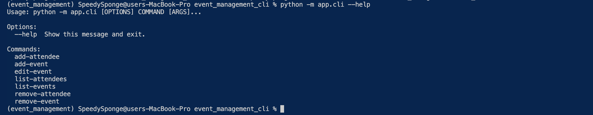

# Event Management CLI

## Introduction

This is a simple CLI application for managing events and attendees.

## Features

- Add, remove, and edit events
- Add and remove attendees for an event
- List all events and attendees

## Setup

1. Create a virtual environment: `pipenv install`.
2. Activate the virtual environment: `pipenv shell`.
3. Install dependencies: `pipenv install`.
4. Run migrations: `alembic upgrade head`.

## Usage

1. To view all available commands: `python -m app.cli --help`
   

2. Add an event: -`python -m app.cli add-event "Birthday Party" --date "2024-03-15" --location "Party Venue"`

   - Specify the event name, date, and location when adding an event.

3. Remove an event: -`python -m app.cli remove-event "EVENT NAME"`

   - Provide the name of the event to remove it.

4. Add an attendee: -`python -m app.cli add-attendee "EVENT_NAME" "ATTENDEE NAME"`

   - Add an attendee to a specific event by providing both event and attendee names.

5. Remove an attendee: -`python -m app.cli remove-attendee "EVENT NAME" "ATTENDEE NAME"`

   - Remove a specific attendee from an event by providing event and attendee names.

6. List events: -`python -m app.cli list-events`

   - View a list of all events.

7. List attendees for an event: -`python -m app.cli list-attendees "EVENT NAME"`

   - View the list of attendees for a specific event.

8. Edit an event: -`python -m app.cli edit-event "Original Event Name" --new_name "Updated Event Name" --new_date "2024-04-01" --new_location "New Location"`
   - Edit the details of a registered event

## Testing

Run tests using `pytest`.

## External Libraries

- Click for CLI interface.
- SQLAlchemy for database interaction.
- Alembic for database migrations.
- Pytest for testing.
